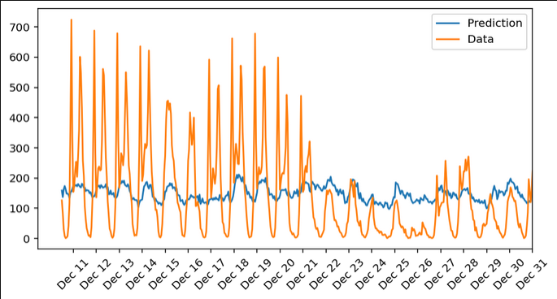
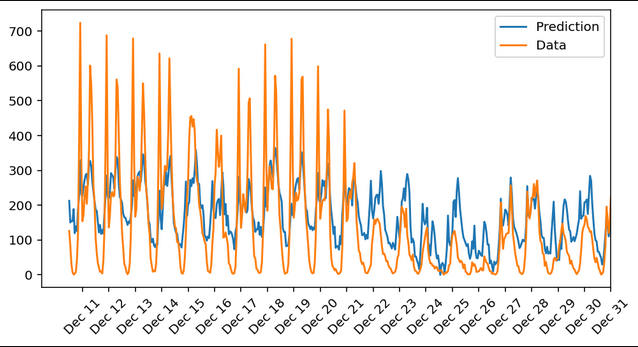
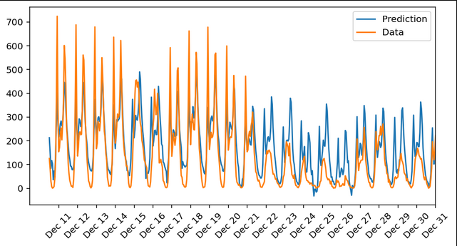
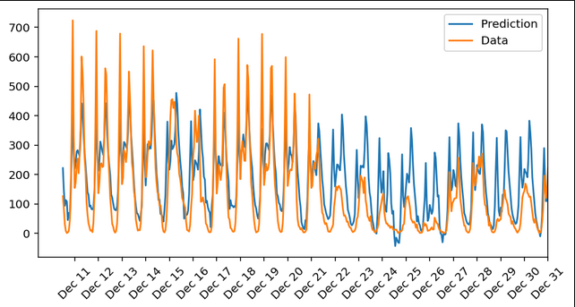
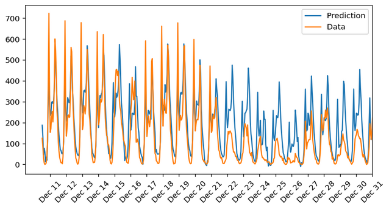
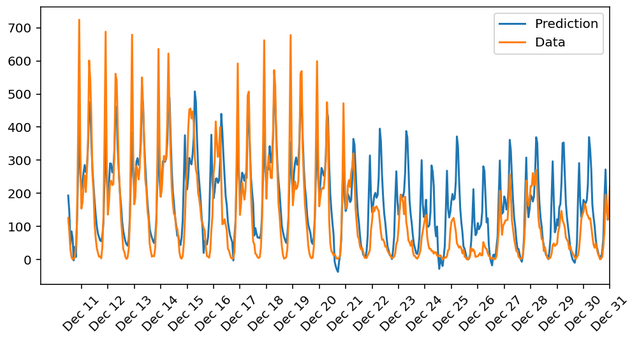
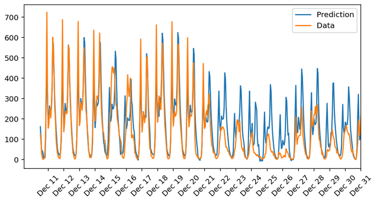
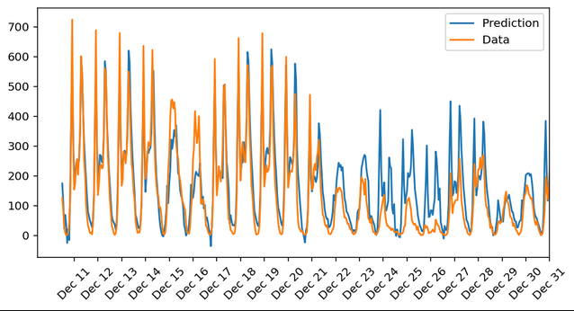

# Intermediate Results

## 100 iterations, 0.1 LR, 2 hidden

## 500 iterations, 0.1 LR, 2 hidden

## 1000 iterations, 0.1 LR, 2 hidden

## 1000 iterations, 0.1 LR, 4 hidden

## 1000 iterations, 0.5 LR, 2 hidden

## 2000 iterations, 0.1 LR, 2 hidden

## 2000 iterations, 0.5 LR, 2 hidden

## 2000 iterations, 0.5 LR, 20 hidden

